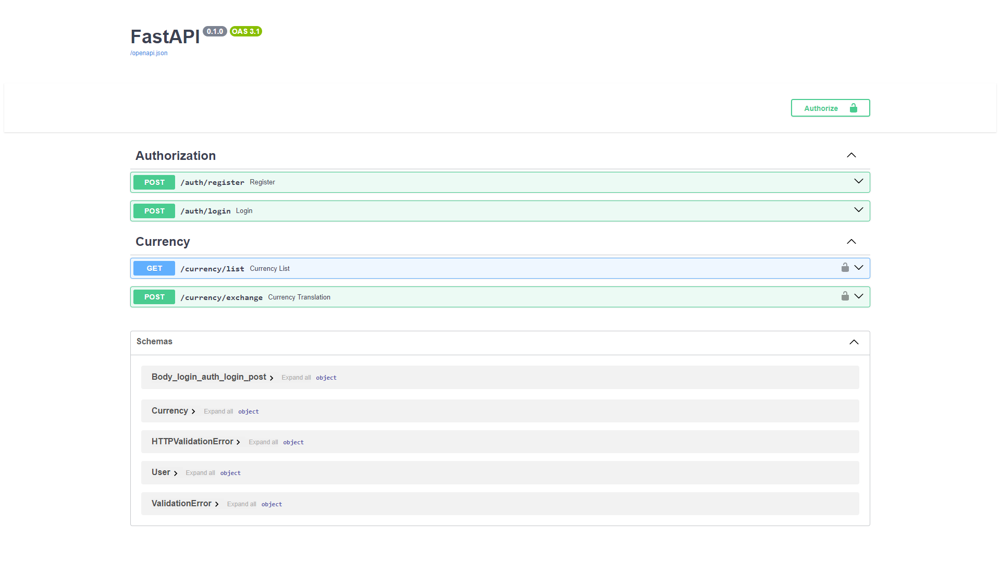

# ExchangeAPI

## Описание приложения
Приложение для обмена валют предлагает пользователям возможность получать актуальные курсы и осуществлять конвертацию между валютами. В системе реализована безопасная аутентификация с использованием JWT и OAuth2. Для хранения данных пользователей, включая хэширование паролей, используется база данных SQLite, доступ к которой осуществляется через SQLAlchemy. Приложение также интегрируется с открытым API, что позволяет получать данные о курсах обмена в режиме реального времени.

#### Endpoints:
1. `/auth/register` (POST): Регистрация нового пользователя с предоставлением имени пользователя и пароля.
2. `/auth/login` (POST): Аутентификация пользователя для получения JWT-токена.
3. `/currency/list` (GET, Защищённый): Возвращает список доступных валют и их кодов.
4. `/currency/exchange` (POST, Защищённый): Выполняет конвертацию валют на основе предоставленных данных и актуальных курсов.

## Quick Start
1. Клонируйте репозиторий: `git clone https://github.com/xeocean/ExchangeAPI.git`
2. Создайте виртуальное окружение: `python -m venv venv`  
   - Для Linux/macOS: `source venv/bin/activate`
   - Для Windows: `venv\Scripts\activate`
3. Установите зависимости: `pip install -r requirements.txt `
4. Настройте переменные окружения в файле: `.env`
5. Запустите сервер: `python main.py`
